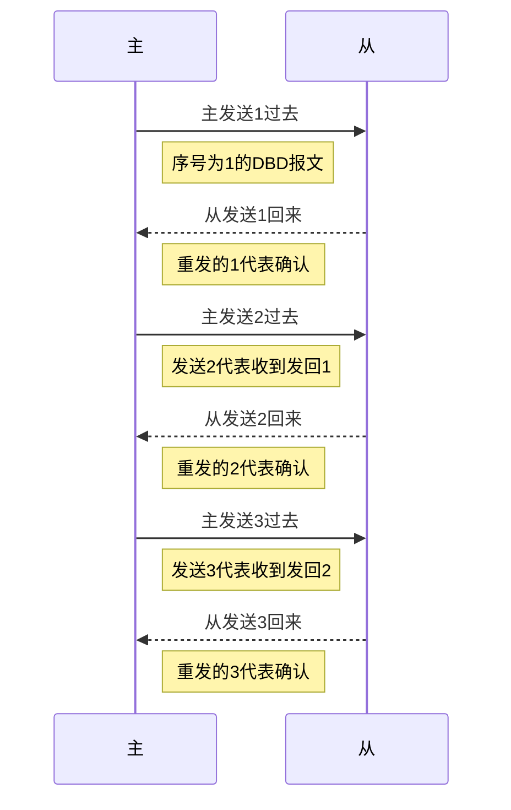

>OSPF的专项笔记

### 建立邻居的六大必要条件
1. RID不同
2. Hello和dead 相同
3. Area ID相同
4. 认证相同
5. 末节区域相同
6. MA网络中掩码相同

###  区域特点:
1. 最大限度地减少路由表条目
2. 本地区域内拓扑变化地影响
3. 在区域边界阻止LSA地泛洪
4. 需要分层网络设计
5. 路由器A和B都是骨干路由器
6. 骨干路由器属于区域0
7. 路由器C, D和E被称为区域边界路由器
8. ABR连接着骨干区域和非骨干区域
### 邻居状态机

| 邻居状态机的八大状态 |                                    |
| -------------------- | ---------------------------------- |
| 1. Down              | 还未启动时                         |
| 2. Attempt 准备状态  | 帧中继网络中才会存在               |
| 3. Init 初始化状态   | 发出Hello进入这个状态              |
| 4. Two-Way状态       | 接收到邻居的Hello报文              |
|                      | 接口网络类型为多路访问时选举DR/BDR |
| 5. Ex-start          | 发出DBD报文(前提情况下是选出DR)    |
| 6.Exchange           |                                    |
| 7. Loading           |                                    |
| 8. Full              |                                    |

广播性多路访问, 非广播性多路访问

#### 邻居状态机的八大状态情况

1. Down 状态      此状态为还未启动时, 基础性内容

2. Attempt 准备状态

   帧中继网络类型中存在,现基本淘汰

3. Init 初始化状态

   发出Hello将进入这个状态

4. Two-Way 状态

   接收到邻居的Hello报文, 且接口网络类型为(非)广播型多路访问时选举DR或BDR

5. Ex-start 状态

   发出DBD报文确定主从Master

   **第一类DBD报文**(不包含LSA头部信息) 确定SEQ

   

   DD Sequence就是DBD报文的序列号

   I (Init)位 :如果置1, 则表示是第一个DBD报文

   M (More)位 :如果置1 ,则表示后续还有其他DBD报文需要交互

   MS (Master)位 :如果置1, 则表示自己是主(master)

   第一个DBD报文中,双方都会置为1

6. Exchange状态 

   **第二类DBD报文**(包含LSA头部信息) 确认SEQ后传递LSA头部信息

   

   使用Mster的DD Sequence开始传递LSA头部信息(隐式确认)

   回送DBD时将DD Sequence加1, 形成隐式的确认机制 直到M位置零为止 

7. Loding 状态 交互LSR和LSU

   LSR信息

   

   LSU报文信息 使用Seq来进行隐式确认 每30分钟泛红刷新一次LSA (Seq加1)

   Seq有多种增长方式

   1. 直线型增长方式
   2. 蚊香型增长方式
   3. 棒棒糖型增长方式

 

8. Full 状态 运行SPF算法

##### DR/BDR选举规则

1. 比较优先级 默认1 范围0~255 越大越优

   ` O表示弃权,不参与选举 255表示`

2. 再比较Router ID, 越大越优

##### Router ID推选规则

1. 手动配置
2. 活跃的环回口中IP地址最大的
3. 活跃的物理接口中IP地址最大的

**DR/BDR具有非抢占性**

选举MASTER只是为了确定序列号

##### 网络类型

| 网络类型                                        |      |
| :---------------------------------------------- | ---- |
| Loopback环回口                                  |      |
| point-to-point 串口 / 帧中继的点到点子接口      |      |
| broadcast BMA                                   |      |
| NBMA 帧中继                                     |      |
| point-to-multipoint 点对多点                    |      |
| point-to-multipoint No-Broadcast 点对多点非广播 |      |

1. 

##### OSPF隐式确认

OSPF报文:

两台路由启用后会互发Hello包
启用OSPF立刻进入Down状态 /邻居down
Hello发送出去,进入第二状态
收到Hello则结束down状态,进入init状态
init 初始化状态Hello发送出去,进入第二状态
双向通信状态2WAY

选主从,看RID选主从,RID大为主,小为从

发送第一条DBD

2. 选完后开始EXCHANGE 预交换

   我利用序号互相确认

> 但是这种方法貌似会一直发送下去? 主为了确认收到了3,就会发送4
>
> 从确认收到了序号4就会重回一个4,主又会发送一次... ...

所以,为了避免这种无休止的隐式确认

DBD就有一个叫做flag INIT   XXX MS

init/ 是否还有更多的DBD/主or从

1/0 1就表示是1DBD.0就表示不是

标记是否为初始化DBD

X表示是否还有更多的DBD,写完就是1,否则0

Y字段表示是主还是从,主写1,从写0

---

隐式确认1

选主从

ying

等待40s ,等待网络中可能有新成员加入,时间到立刻选举DR 

6. Looding 加载LSA

互发LSR,互发LSU

形成LSDB

7. FULL领接状态完成

全量同步LSDB.每30M同步一次3600S超时

两端MTU值不一直回导致,卡在EXSTART和EXCHANGE中

限制LSA条目数,超过这条目数,就会卡在Looding状态

##### OSPF报文类型

| 报文类型               | 报文                                              |
| ---------------------- | ------------------------------------------------- |
| Hello [打招呼] 打招呼  | 发现,建立和维护邻居关系                           |
| DBD [数据库描述] 菜单  | LSA的头部信息                                     |
| LSR [请求报文]  点菜   | 向邻居请求需要的LSA信息                           |
| LSU [更新报文] 上菜    | 向邻居通告被需要的LSA信息[你要什么我就给你发什么] |
| LS Ack [确认报文] 买单 |                                                   |

##### OSPF报文头部格式  

##### Headr报文示例

| HELLO报文中主要的字段(参数)    |                   |
| ------------------------------ | ----------------- |
| Router ID                      | 路由器的RID       |
| Hello and dead intervals ***** | Hello和dead的时间 |
| Neighbors                      | 邻居信息          |
| Area ID *****                  | 区域号            |
| Router priority                | 路由接口优先级    |
| DR IP address                  | DR的IP            |
| BDR IP address                 | BDR的IP           |
| authentication password *****  | 认证密码          |
| Stub area flag *****           | 特殊区域标识      |

**必要条件: 建立邻居的过程当中, 这四个必须是匹配的, 只有匹配了才能够建立邻接关系**

### 起邻居要求

1. RID不同
2. Hello/dead 相同
3. Area ID相同
4. 认证相同
5. 末节区域相同
6. MA网络中掩码相同

### 邻居状态机*

1. Down
2. Attempt 准备状态 `这个状态在帧中继网络中才有`
3. Init 初始化状态 
4. Two-Way状态
5. Ex-start
6. Exchange
7. Loading
8. Full

------------

## OSPF系列2 LSA链路状态通告

|         | P2P  | P2MP | P2MP NB | BMA  | NBMA |
| ------- | ---- | ---- | ------- | ---- | ---- |
| P2P     | OK   |      |         |      |      |
| P2MP    |      | OK   |         |      |      |
| P2MP NB |      |      | OK      |      |      |
| BMA     |      |      |         | OK   |      |
| NBMA    |      |      |         |      | OK   |

建立OSPF邻居过程中,没有网络类型概念, 网络类型没有关系

P2P和BMA Hello 为10 Dead为40

其他三种网络类型(不包括环回) Hello时间为30 Dead时间为120

起邻居和能不能传递路由是两码事, 不代表邻居Full状态了就一定能够传递路由

P2MP NB 要敲个never,才能发送Hello报文的

点对点和广播性虽然能能够启动邻居, 但是路由无法传递的,LSA类型问题

LSA

LSU内部的信息

| 类别 | 名称                           | 描述                                                         |
| ---- | ------------------------------ | ------------------------------------------------------------ |
| 1    | 路由器LSA                      | 区域内Router产生,描述了路由器所有接口,链路和Cost值。只能在本区域内泛洪 |
| 2    | 网络LSA                        | 由DR产生,报文包括了七7连接的所有Router的RouterID, 其中包含了自己的RouterID |
| 3    | 网络汇总LSA                    | 可以通知本区域内的路由器通往区域外的路由信息。默认路由也被通告。 Link ID 为目标网段的ID |
| 4    | ASBR汇总LSA (ASBR summary LSA) | 也是由ABR产生, 但是它是一条主机LSA,指向ASBR的路由器          |
| 5    | 自治系统外部汇总LSA            | 由ASBR产生, 告诉本自治区的路由器通往外部自治区的路径。       |                                       |
| 7    | NSSA外部LSA                    | 由ASBR产生, 几乎和LSA5通告是相同的, 但NSSA外部LSA通告仅仅在始发这个NSSA外部LSA通告的非纯末梢区域内部进行泛洪。 |

- 1类LSA Router LSA

  产生者: 所有路由器

  作用: 通告自身直连接口的信息

  通告范围: 仅限于本区域

  在不需要选举DR的网络中:类似于环回口,的1类LSA中包含掩码

  需要选举DR的1类LSA中, 不带有掩码  

  

- 2 类LSA Network LSA

  只有需要选举DR的网络类型中才会出现2类LSA

  产生者: DR **故:若在点对点网络环境中, 没有产生DR,则没有二类LSA**

  作用: 通告掩码

  范围: 本区域

  

- 三类LSA Summary LSA

  产生者: ABR

  作用: 汇总本区域的1和2类通告给其他区域

  通告范围: 整个OSPF网络

  注: 本质是路由信息,具有一定的距离矢量特性 非骨干区域禁止传递3类LSA

  

- 五类LSA External LSA自治系统外部汇总LSA

  产生者: ASBR

  作用; 通告外部路由信息

  通告范围: 整个OSPF网络

- 四类LSA  ASBR Summary LSA

  产生者: ASBR所在区域的ABR

  作用; 通告ASBR的位置

  

- 七类LSA NSSA External LSA

RID要保证它的唯一性 标识符 防环
LS 自我介绍 详尽学习LSA类型前,我们先了解
**LSA为什么要分类?**

>LSDB太大 减少区域内的LSDB

1. 把所有区域中的LSDB减小

| 专业术语                                    | 注释                                                      |
| :------------------------------------------ | :-------------------------------------------------------- |
| 链路状态通告 (LSA Link State Advertisement) | LSA描述了路由所有的链路, 接口, 路由的邻居以及链路状态信息 |
| LSDB（Link State Database ）                | 链路状态数据库用于存放LSA                                 |
|                                             |                                                           |
| 末梢区域 (Stub Network)                     | 指没有和其他路由器相连的网络                              |
| keepalive                                   | 邻居之间交换的Hello数据包称为keepalive 。                 |
|                                             |                                                           |
|                                             |                                                           |
|                                             |                                                           |
|                                             |                                                           |

1. 每一台收到邻居路由器发出的LSA的路由器发出的LSA的路由器都会把这些LSA记录在它的链路状态数据库当中,并且发送一份LSA的拷贝给该路由器的其他所有邻居 。
2. 

Router-id得到过程

1. 如果有手工配置的RID,那么就使用RID

2. 如果没有手工配置的RID,路由器就取它环回口(loopback)接口上数值最高的IP地址

3. 如果路由器没有配置IP地址的loopback接口,那么路由器将选取它所有的物理接口上数值最高的IP地址。用作路由器ID的接口不一定非要运行OSPF协议 。

   使用loopback接口作为路由器ID有两个好好处 :

   - loopback接口比任何其他物理接口更稳定。一旦路由器启动成功,这个换回接口就处于活动状态,只有整个路由器失效时,它才会失效 。

   - 网络管理员在预先分配和识别作为路由器ID的地址时有更多的回旋余地 。

## Hello协议

Hello 协议服务于以下几个目的:

- 它是发现邻居路由器的方法;
- 在两台路由器成为邻居之前,需要通告这两台路由器必须相互认可的几个参数;
- Hello 数据包在邻居路由器之间担当keepalive的角色

### LSA类型

| 类别 | 名称                          | 描述                                                         |
| ---- | ----------------------------- | ------------------------------------------------------------ |
| 1    | 路由器LSA                     | 区域内Router产生, 描述了路由器所有接口 , 链路和Cost值, 只能在本区域内泛洪 。 |
| 2    | 网络LSA                       | 由DR产生, 报文包括了其链接的所有Router的routerID ,其中包含自己的RouterID 。 |
| 3    | 网络汇总LSA                   | 可以通知本区域内的路由器通往区域外的路由信息。               |
| 4    | ASBR汇总LSA(ASBR Summary LSA) | 也是由ABR产生, 但是它是一条主机LSA,指向ASBR路由器            |
| 5    | 自治系统外部汇总LSA           | 由ASBR产生, 告诉本自治区的路由去通往外部自治区的路径 。      |
| 6    | NSSA外部LSA                   | 由ASBR产生, 几乎和LSAS通告是相同的, 但NSSA外部LSA通告仅仅在始发这个NSSA外部LSA通告的非纯末梢区域内部进行泛洪 。 |

**1.  1类LSA Router LSA **

   1.# 产生者 : 所有路由器
   2.# 作用 : 通告自身直连接口的信息
   3.# 通告范围 : 仅限本区域
注: 在需要选举DR得网络中1类LSA不包含掩码

只允许在本区域内泛洪, 不允许跨越ABR 。 

Link ID 是本来路由器的RID

ADV ID 是本路由器的RID

环回口 : stub net ,IP 大致, mask (32位) ,metric

MA网络接口: Transit Network ,Dr的IP, 本地IP metric

P2P网络;: another Router(P2P) NID RID ,本地IP ,metric

**2. 2类LSA Network LSA**

产生者 : DR

只有需要选举DR 的网络中 才有二类LSA

通告范围 : 

补充一类LSA中对MA网络的描述 : 掩码, 成员RID 

在相同区域中, 所有路由器会同步1,2类LSA

**3类LSA**

LSA变成路由 再重新打包变成LSA 

描述的内容包括: 网络号, 

